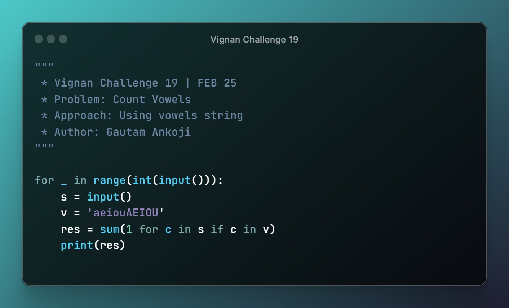
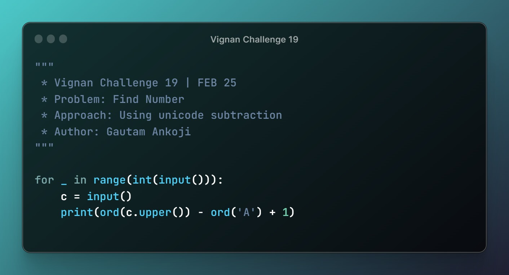
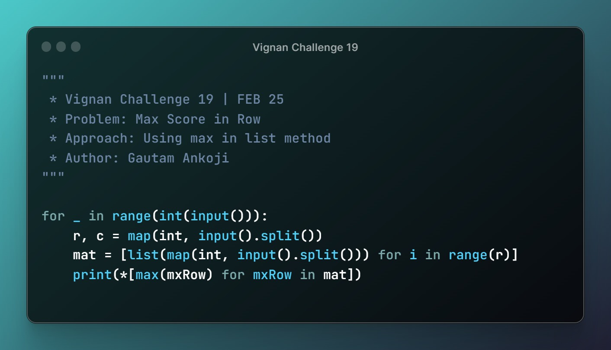
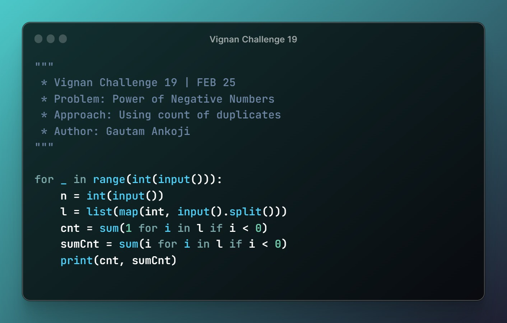
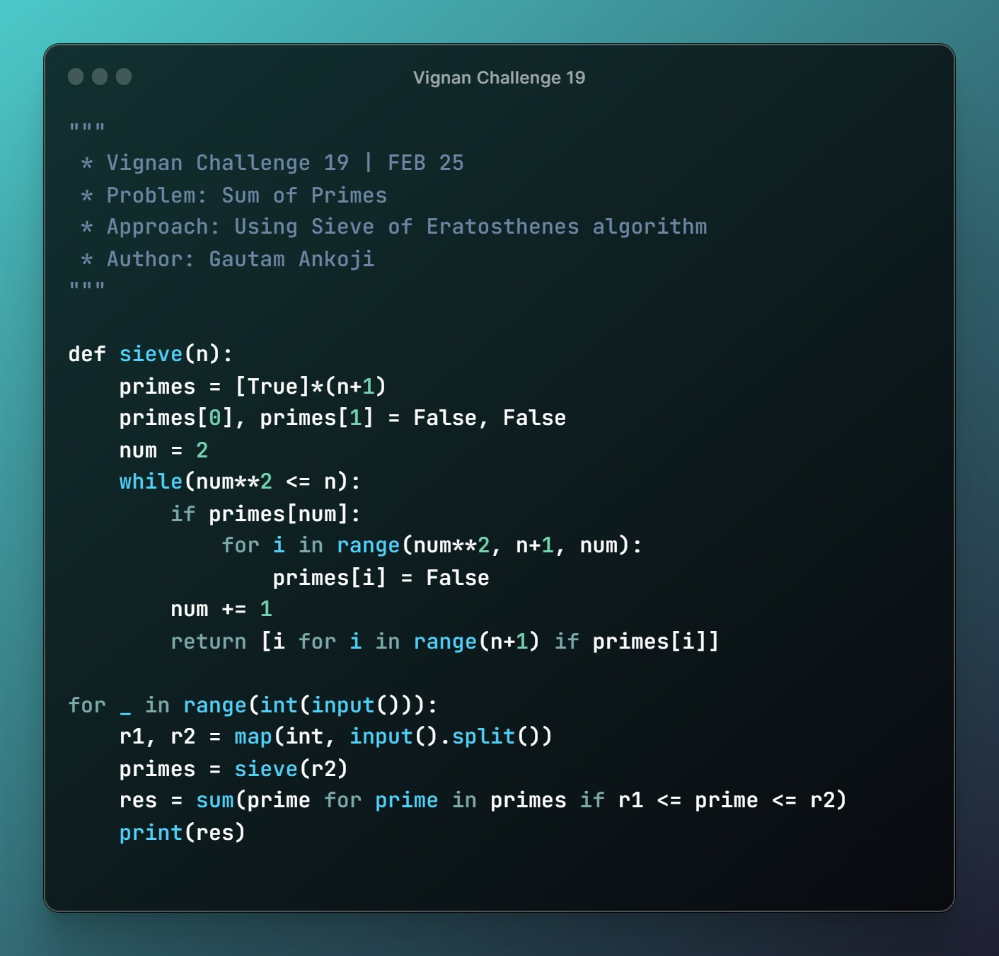

# VIGNAN-CHALLENGES

This repository covers the solutions to the Vignan Challenge conducted by the Vignan's Institute of Information Technology, Viag India.

### [**VIGNAN CHALLENGE 19**](./vignan-challenge-19/)

#### <a target="_blank" href="https://github.com/gautamankoji">• Approach 1</a>: Authored by <a target="_blank" href="https://github.com/gautamankoji">@gautamankoji</a>

    <a href="./vignan-challenge-19/challenge-19-gatamankoji/problems/cnt_family_members.py"><kbd></kbd></a>
    <a href="./vignan-challenge-19/challenge-19-gatamankoji/problems/cnt_vowels.py"><kbd></kbd></a>
    <a href="./vignan-challenge-19/challenge-19-gatamankoji/problems/decimal_binary.py"><kbd></kbd></a>
    <a href="./vignan-challenge-19/challenge-19-gatamankoji/problems/find_number.py"><kbd></kbd></a>
    <a href="./vignan-challenge-19/challenge-19-gatamankoji/problems/max_score_in_row.py"><kbd></kbd></a>
    <a href="./vignan-challenge-19/challenge-19-gatamankoji/problems/nth_fibonacci.py"><kbd></kbd></a>
    <a href="./vignan-challenge-19/challenge-19-gatamankoji/problems/pair_dragons.py"><kbd></kbd></a>
    <a href="./vignan-challenge-19/challenge-19-gatamankoji/problems/power_of_negetive_num.py"><kbd></kbd></a>
    <a href="./vignan-challenge-19/challenge-19-gatamankoji/problems/sum_of_primes.py"><kbd></kbd></a>

